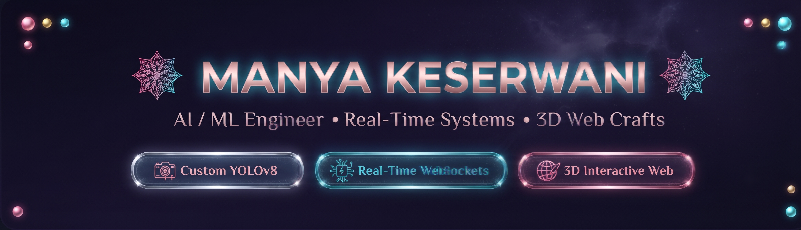

  

  

---

### 💫 About Me

> ### 👋 Full-Stack & AI/ML Engineer crafting low-latency real-time pipelines, computer vision systems, and interactive 3D web experiences.

- 🔭 **Building:** **[VIGILANT](#-flagship-project-vigilant)** — Real-time AI surveillance engine with custom **YOLOv8 (91.44% precision)**.
- ⚡ **Core Specialties:** **Real-Time WebSockets**, **Microservices (FastAPI + Node.js)**, **3D Web (React Three Fiber)** & **System Design**.
- 🧠 **CS Foundations:** Strong mastery of **DAA**, **OOPS**, **DBMS**, and algorithmic problem-solving (**200+ on LeetCode**).
- 🌱 **Currently Exploring:** **RAG architectures**, **Agentic AI workflows**, and **open-source LLM fine-tuning**.
- 💬 **Ask Me About:** Real-time inference pipelines, **YOLOv8** computer vision, microservice architecture, and 3D creative web.

---

### 🛡️ Flagship Project: VIGILANT

> **Autonomous real-time video surveillance and restricted-zone monitoring engine powered by custom-trained YOLOv8 and event-driven microservices.**

-EC4899?style=flat-square&logo=threedotjs)

- 🏗️ **Decoupled 3-Service Architecture:** Python/FastAPI ML microservice isolated behind a high-throughput API from Node.js/Express backend and React/TypeScript frontend.
- ⚡ **Sub-Second Real-Time Pipeline & WebSockets:** Instant flow from camera capture → YOLOv8 inference → spatial zone containment check → WebSocket alert broadcast (**91.44% precision** on test data).
- 📐 **Resolution-Independent Polygon Zone Editor:** Vector boundary canvas with normalized coordinates ($x, y \in [0, 1]$) replacing rigid rectangle boxes across any display resolution.
- ⏱️ **Dwell-Time Severity & Cooldown Throttling Algorithm:** Multi-frame temporal tracking scoring threat by occupancy density and continuous dwell duration, with duplicate alert suppression.
- 🌐 **Interactive 3D Visuals & Security:** Immersive **React Three Fiber (Three.js)** 3D landing environment secured with **JWT & bcrypt** authentication.

---

### 🚀 Other Featured Projects

- 🤖 **RepoPilot AI:** GitHub automation agent with semantic duplicate detection (**pgvector**), multi-LLM failover (**Gemini + OpenAI**), and async queue processing (**BullMQ + Redis**).
- 🔍 **Prism:** Multi-modal AI credibility analyzer ingesting 7 content formats with dual-layer OCR, speech-to-text, and interactive **Three.js 3D** UI.
- 🔐 **Authify:** Production-grade auth system with **JWT refresh-token rotation**, Axios interceptor queuing, and role-based access control (RBAC).

---

### 💻 Tech Stack & Tooling

#### 🗣️ Languages

#### 🤖 AI, Machine Learning & Computer Vision

#### ⚙️ Backend, Real-Time & Systems

#### 🎨 Frontend, 3D & Creative Tech

#### 🗄️ Databases & Storage

#### ☁️ Cloud, DevOps & Tools

---

### 💡 Favorite Dev Quote
> *“Make it work, make it right, make it fast.”*  
> — **Kent Beck**

 

*“Turning 'it works' into interactive 3D experiences with sub-second latency and mathematical reliability.”*

