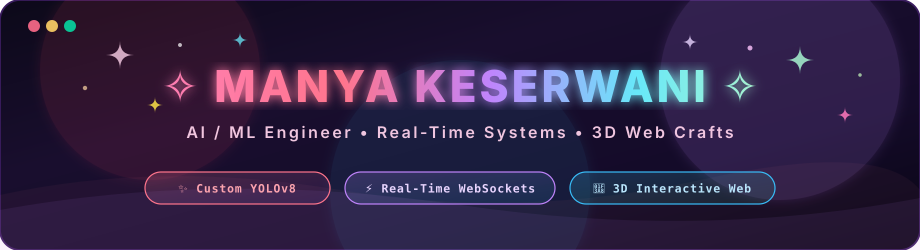

  

  

---

# 💫 About Me

👋 Hey there! I'm **Manya** — a Full-Stack & AI/ML Engineer passionate about architecting scalable microservices, low-latency real-time pipelines, and production-grade computer vision systems.

🔭 **I'm currently working on:**  
**[VIGILANT](#-flagship-project-vigilant--autonomous-real-time-surveillance--alert-system)** — an enterprise-grade, real-time AI video surveillance and alert system that performs restricted-zone monitoring using a custom-trained **YOLOv8** model.

🤝 **I'm looking to collaborate on:**  
High-performance backend systems, real-time streaming architectures, AI/ML-driven developer tooling, and innovative open-source projects.

🧠 **Engineering Focus & Core Concepts:**  
- **Real-Time Systems & WebSockets:** Low-latency event streaming, bi-directional client-server synchronization, and live telemetry feeds.
- **DAA (Design & Analysis of Algorithms):** Algorithmic complexity, Point-in-Polygon geometric intersection, sliding-window temporal tracking, and rate-limiting / throttling algorithms.
- **OOPS (Object-Oriented Programming):** SOLID principles, modular service encapsulation, clean API contracts, and model-agnostic abstraction layers.
- **DBMS & Data Persistence:** Relational schema design (**PostgreSQL**), vector embeddings & similarity search (**`pgvector`**), document stores (**MongoDB**), and distributed caching/message queues (**Redis**).
- **AI / ML & Computer Vision:** Custom deep learning architectures (**YOLOv8**), transfer learning, model evaluation metrics, and multi-modal LLM integration.
- **Cloud Computing & DevOps:** Containerized microservices (**Docker, Docker Compose**), **Nginx** reverse proxies, cloud infrastructure (**AWS, GCP, Railway, Render, Vercel, Netlify**), and **CI/CD via GitHub Actions**.
- **Data Analytics:** Real-time spatial analytics, intrusion dwell-time metrics, confidence score distributions, and temporal trend tracking.

🌱 **I'm currently exploring:**  
Retrieval-Augmented Generation (RAG), Agentic AI Workflows & Multi-Agent Orchestration, Vector Search Optimization, and Fine-Tuning Open-Source LLMs.

💬 **Ask me about:**  
Real-time pipelines, **YOLOv8** computer vision, Python/FastAPI microservices, Node.js/Express, React/TypeScript, WebSockets, and database architecture.

⚡ **Fun fact:**  
I enjoy turning *"it works"* into interactive 3D visual experiences backed by sub-second latency and mathematical reliability.

---

# 🛡️ Flagship Project: VIGILANT — Autonomous Real-Time Surveillance & Alert System

> **An AI-based real-time video surveillance and restricted-zone monitoring engine powered by custom-trained YOLOv8 and event-driven microservices.**

-EC4899?style=flat-square&logo=threedotjs)

### 🔑 Key Architectural & Engineering Highlights:

1. **Decoupled 3-Service Microservice Architecture:**  
   Architected a three-tier full-stack system consisting of a **Python/FastAPI ML microservice**, a **Node.js/Express backend**, and a **React/TypeScript frontend**. Cleanly isolated the trained YOLOv8 model behind a lightweight, high-performance API so ML inference workloads and product layers build, scale, and deploy independently.

2. **End-to-End Real-Time Pipeline & WebSockets (91.44% Precision):**  
   Engineered a seamless sub-second detection pipeline:  
   $$\text{Camera Capture} \longrightarrow \text{Model Inference} \longrightarrow \text{Zone-Containment Verification} \longrightarrow \text{Severity Scoring} \longrightarrow \text{Instant WebSocket Broadcast}$$  
   Integrated a custom-trained **YOLOv8** model that achieved **91.44% precision** on held-out test data for restricted-zone detection.

3. **Interactive, Resolution-Independent Polygon Zone Editor:**  
   Designed a dynamic vector boundary editor where users click to place vertices and drag to reposition zone boundaries directly over a live video feed. Boundary coordinates are stored as **normalized coordinates** ($x, y \in [0, 1]$) rather than fixed pixel dimensions — eliminating the brittle hardcoded-rectangle limitation and ensuring precision across any resolution or display aspect ratio.

4. **Dwell-Time-Aware Severity & Cooldown Throttling Algorithm:**  
   Designed a temporal scoring algorithm that evaluates threat severity by model detection confidence, live occupancy count, and continuous cross-frame dwell duration in the restricted area. Incorporated sliding-window cooldown throttling to prevent duplicate alerts and notification storms.

5. **Interactive 3D Landing Experience & Hardened Security:**  
   Built an engaging 3D landing environment with **React Three Fiber (Three.js)**, paired with **JWT and bcrypt** authentication protecting configuration endpoints and monitoring controls — combining real-time systems, 3D graphics, and security fundamentals in one project.

---

# 🚀 Other Featured Projects

<b>🤖 RepoPilot AI — AI-Powered GitHub Automation Agent</b>

 

- Full-stack AI automation platform leveraging the **GitHub Apps API** to auto-triage issues, summarize pull requests, and detect duplicate tickets via semantic vector search (**PostgreSQL + `pgvector`**).
- Designed a model-agnostic LLM abstraction layer (**Gemini + OpenAI**) with automatic failover and rule-based fallback.
- Architected an asynchronous job-processing queue (**Node.js, Express, BullMQ, Redis**) to decouple webhook ingestion from AI processing with idempotency guarantees.
- Containerized with **Docker Compose** and deployed on **Railway**.

<b>🔍 Prism — AI-Powered Misinformation & Credibility Analyzer</b>

 

- Multi-modal AI credibility platform ingesting **7 content formats** (text, URLs, PDFs, DOCX, PPTX, images, audio), leveraging the **Gemini API** for real-time fact-checking.
- Built a dual-layer OCR and speech-to-text pipeline (**Google Cloud Vision API, Tesseract.js fallback, Google Cloud Speech-to-Text**) for robust document and audio extraction.
- Containerized with **Docker Compose** and an **Nginx** reverse proxy; features an interactive **Three.js / React Three Fiber** 3D interface.

<b>🔐 Authify — Production-Grade Authentication Engine</b>

 

- End-to-end authentication platform built with **React + Vite, Context API, Node.js/Express, and MongoDB**.
- Implemented **JWT refresh-token rotation**, Axios interceptor request queuing, role-based access control (RBAC), and Google OAuth integration.

---

# 💻 Tech Stack & Tooling

### 🗣️ Languages

### 🤖 AI, Machine Learning & Computer Vision

### ⚙️ Backend, Real-Time & Systems

### 🎨 Frontend, 3D & Creative Tech

### 🗄️ Databases & Storage

### ☁️ Cloud, DevOps & Tools

---

# 📊 GitHub Analytics & Live Stats

  

  

### ✍️ Random Dev Quote

---

*“Turning 'it works' into interactive 3D experiences with sub-second latency and mathematical reliability.”*

